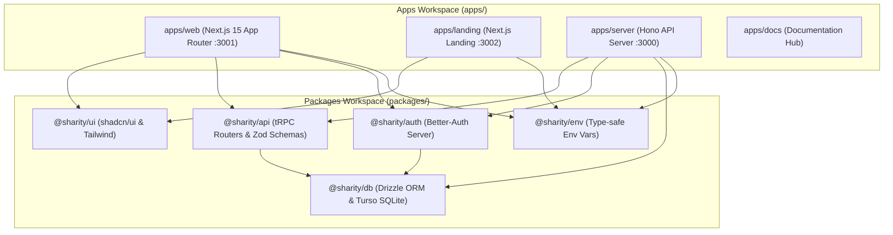
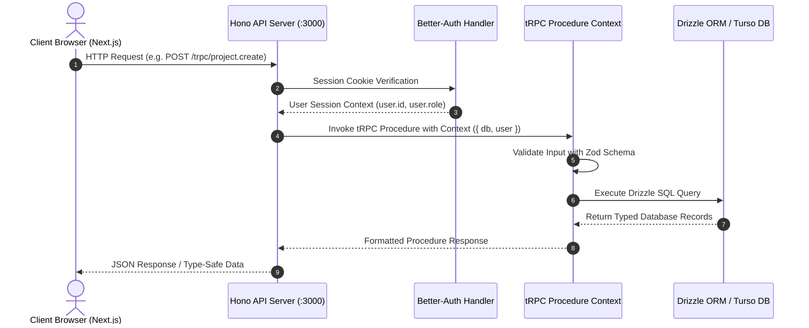

# Sharity — System Architecture & Technical Specifications

> **Comprehensive Technical Architecture Blueprint**  
> Companion to [Master Product Blueprint](file:///Users/shrid/sharity/apps/docs/Sharity_Master_Document.md), [Database Schema Spec](file:///Users/shrid/sharity/apps/docs/architecture/database_schema.md), and [Development Guide](file:///Users/shrid/sharity/apps/docs/guides/development_guide.md)

---

## 1. Monorepo Architecture & Dependency Graph

Sharity is built as a unified TypeScript monorepo managed by **Turborepo** and powered by **Bun**. The monorepo separates web applications, API handlers, database access, authentication, and design system components into isolated packages.

---

## 2. Server Routing & Request Lifecycle

### 2.1 Endpoint Mounting in Hono (`apps/server/src/index.ts`)
- `/api/auth/*`: Better-Auth authentication endpoints (sign-in, sign-up, sign-out, session retrieval).
- `/trpc/*`: tRPC HTTP endpoint wrapped by `@trpc/server/adapters/fetch` for type-safe procedure execution.
- CORS Middleware: Configured to allow origins `http://localhost:3001` (Web) and `http://localhost:3002` (Landing).

---

## 3. Technology Stack & Package Responsibilities

| Layer | Library / Tool | Location | Key Responsibility |
|---|---|---|---|
| Runtime | **Bun (v1.1+)** | Monorepo Root | Script runner, package manager, and native TypeScript execution engine |
| Build Orchestration | **Turborepo** | Monorepo Root | Parallel execution and intelligent task caching (`check-types`, `build`, `dev`) |
| Web Application | **Next.js 15+ (App Router)** | `apps/web` | React Server Components, client state, routing, and page rendering |
| Marketing Web | **Next.js 15+** | `apps/landing` | High-conversion, SEO-optimized public landing experience |
| API Server Framework | **Hono** | `apps/server` | Ultrafast HTTP server running on Bun (Port 3000) |
| API Protocol | **tRPC (v11)** | `packages/api` | End-to-end type-safe API procedures and Zod validation schemas |
| Authentication | **Better-Auth** | `packages/auth` | Type-safe authentication, session cookies, and Drizzle SQLite adapter |
| Database ORM | **Drizzle ORM** | `packages/db` | Type-safe SQL query builder and Drizzle Studio GUI |
| Database Engine | **libSQL / Turso / SQLite** | Local Port `8080` | Embedded SQLite server with cloud Turso sync compatibility |
| UI & Styling | **Tailwind CSS + shadcn/ui** | `packages/ui` | Reusable UI components, design tokens (`globals.css`), and accessibility primitives |
| Environment | **@t3-oss/env-core** | `packages/env` | Compile-time and runtime validation of environment variables |

---

## 4. Architectural Technical Priorities

### Priority 1: High-Performance Data Access (Current Phase 1)
- **Prepared Statements & Indexes:** Database queries filter on indexed columns (`projectId`, `creatorId`, `status`, `category`).
- **tRPC React Query Caching:** Stale times configured for static lookup data (categories, city lists) while invalidating queries upon mutation (project creation, milestone submission).

### Priority 2: Resilience & Error Handling
- **Type-Safe Exceptions:** Business logic throws `TRPCError` with specific code (`UNAUTHORIZED`, `FORBIDDEN`, `NOT_FOUND`, `BAD_REQUEST`).
- **Graceful Fallbacks:** UI components render skeleton states (`@sharity/ui/components/skeleton`) during loading and user-friendly error banners on failures.

### Priority 3: Security & Data Isolation
- **Auth Guards:** `protectedProcedure` enforces valid user session; `adminProcedure` verifies `user.role === 'admin'`.
- **Input Sanitization:** All incoming procedure payloads are validated against Zod schemas before hitting the database.
