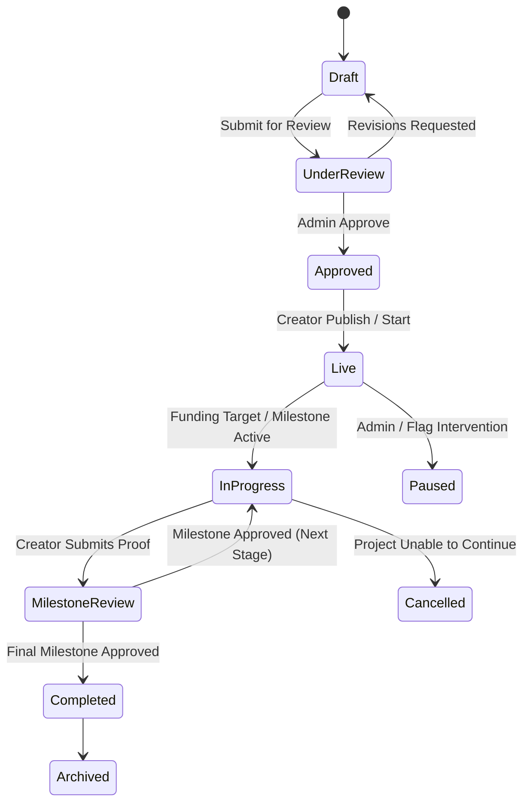

# Sharity — Impact Projects & Needs Engine Specification

> **Feature Specification**  
> Companion to [Master Product Blueprint](file:///Users/shrid/sharity/apps/docs/Sharity_Master_Document.md) and [Database Schema](file:///Users/shrid/sharity/apps/docs/architecture/database_schema.md)

---

## 1. Overview

An **Impact Project** on Sharity is a transparent, community-driven action to solve a specific local problem. Unlike generic crowdfunding campaigns, an Impact Project is built on:
1. Multi-modal **Needs** (Money, Items, Volunteers, Skills).
2. A structured **Milestone Plan** for funding releases.
3. Visible **Evidence & Progress Updates**.
4. A final public **Impact Report**.

---

## 2. Project Lifecycle State Machine



### State Definitions
- **Draft:** Proposal being written by creator; invisible to public.
- **Under Review:** Submitted to Sharity reviewers for safety, clarity, identity, and budget verification.
- **Approved:** Passed review; ready to go live.
- **Live:** Active on platform; accepting contributions, volunteer sign-ups, and item pledges.
- **In Progress:** Work has begun; current active milestone is being executed.
- **Milestone Review:** Creator has uploaded evidence for the current milestone; platform reviewers are evaluating proof.
- **Completed:** All milestones finished, verified, and final Impact Report published.
- **Paused / Cancelled:** Paused due to flags or cancelled with remaining fund redirection options.

---

## 3. Needs Classification Engine

Projects state what they need upfront so contributors can offer their most useful resource:

```text
Needs
├── Financial Need (Target INR budget split across milestones)
├── Item / Material Need (Physical goods e.g. 50 school bags, 10 paint buckets)
├── Volunteer Need (General on-ground assistance e.g. 12 park cleanup volunteers)
└── Skill Need (Specialized help e.g. 1 carpenter, 1 legal counsel, 1 photographer)
```

- Each need tracks `quantityTarget` and `quantityFulfilled`.
- Visual progress bars on the project detail page reflect overall fulfillment for each need type.

---

## 4. Project Health Score

The Project Health Score provides a clear human-readable status signal (`Healthy`, `Needs Attention`, `Paused`) based on objective indicators:

| Health Signal | Trigger Condition | Status Impact |
|---|---|---|
| Active Progress | Milestone on schedule, updates posted within last 14 days | 🟢 `Healthy` |
| Delayed Evidence | Milestone past due date by > 14 days without update | 🟡 `Needs Attention` |
| Unresolved Flags | Community safety flags pending review | 🟡 `Needs Attention` |
| Failed Verification | Milestone proof rejected with revision request | 🔴 `Paused / Intervention` |
